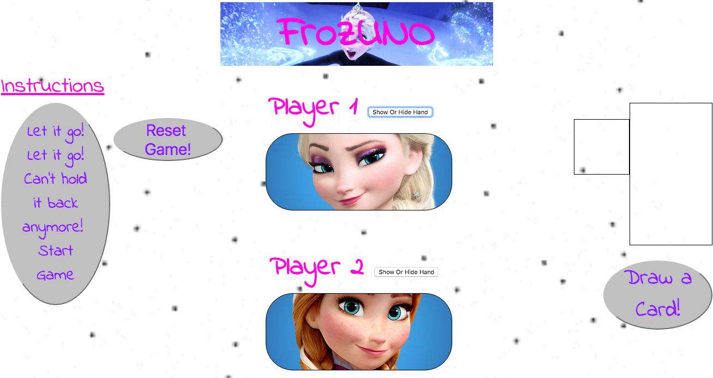
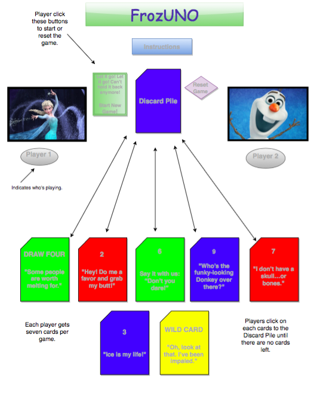

# FrozUNO

## Javascript Based Children's Card Game

Game Setup:  FrozUNO is an interactive game for kids, ages 3 and up.  Through this Frozen-themed game, children learn about color, number, and word association.  You can play with up to 2 players per game.  At the start of a new game, each player starts with seven cards and a card is placed in the Discard Pile.  

Game Play:  Each player tries to match the card in the Discard Pile.  You have to match by either the number, color, or the symbol/Action.  For example, if the Discard Pile has a blue card that is an 3, you have to either place a blue card or a card with the number 3 on it in the Discard Pile.  You can also play a Wild card (which can change the current color in play).  If the player has no matches or chooses not to play any of their cards even though they have a match, they must draw a card from the Draw Pile.  The player must play one card each round.  The game continues until a player has one card left.  The moment a player has one card left the game will alert that someone has FrozUNO.  The player who is the first to have no cards left wins the game.

## Controls

To start a new game, click on the Start button.  To reset, click Reset button.

Players can use their mouse to click on the card they want to play.  

Players can click the "Get a Card" button to get a new card when necessary.  

## To Play

To play, check out http://tifsheline.github.io/FrozUNO.

## Development Process

Techonologies Used: HTML / CSS / Javascript + Jquery

By creating objects in Javascript and Jquery, the game is able to generate a new game of randomly selected cards by simply clicking Start New Game or Reset Game.  Other objects created using Javascript and Jquery allows the user to show or hide their hand and get a card from the draw pile.

## Not-Yet-Implemented

* Detailed graphic design
* Increasing difficulty as player progresses
* Built in theme choices

## User Stories

1. As a player, I can control the game through simply clicking the snowflake on the cards to place them in the Discard Pile.

2. As a player, I can start a new game with a single click so that I can start over the game without having to refresh the page.

3. As a player, I can reset the game at any point throughout the game by clicking the Reset button.

## Future Implementations

1. As a player, I can choose different characters from Frozen as my avatar.

2. As a player, I can choose different themes from the movie which changes the cards background image and sound effects.

3. As a player, I can choose other Disney themed games for learning.

4. As a player, I can choose to play against as many as 8 players.
